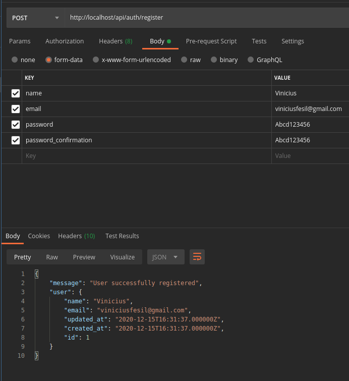

# Roadmap

## Authentication

- Create a project

    ```sh
    curl -s https://laravel.build/birthday-reminder | bash
    cd birthday-reminder
    ```

- Set an alias for sail
    - Open your `~/.profile` file
    - Put these line below at the bottom of the file

      ```sh
      alias sail='bash vendor/bin/sail'
      ```

- Setup your `.env` file

    ```dotenv
    DB_CONNECTION=mysql
    DB_HOST=mysql
    DB_PORT=3306
    DB_DATABASE=birthday_reminder.api
    DB_USERNAME=root
    DB_PASSWORD=
    ```

- Start the application

    ```sh
    ./vendor/bin/sail up
    ```

- Execute migrations

    ```sh
    sail artisan migrate
    ```

- Require `tymon/jwt-auth:^1.0.2` dependency

    ```sh
    composer require tymon/jwt-auth:^1.0.2
    ```

- Add the service provider to the providers array in the `config/app.php` config file as follows:

    ```php
    'providers' => [
        //...

        Tymon\JWTAuth\Providers\LaravelServiceProvider::class,
    ],
    ```

- Publish `LaravelServiceProvider`

    ```sh
    php artisan vendor:publish --provider="Tymon\JWTAuth\Providers\LaravelServiceProvider"
    ```

- Generate a new JWT secret

    ```sh
    php artisan jwt:secret
    ```

- Open the `app/Models/User.php` file and replace the following code with the existing code.

    ```php
    <?php

    namespace App\Models;

    use Illuminate\Contracts\Auth\MustVerifyEmail;
    use Illuminate\Database\Eloquent\Factories\HasFactory;
    use Illuminate\Foundation\Auth\User as Authenticatable;
    use Illuminate\Notifications\Notifiable;

    use Tymon\JWTAuth\Contracts\JWTSubject;

    class User extends Authenticatable implements JWTSubject
    {
        use HasFactory, Notifiable;

        /**
         * The attributes that are mass assignable.
         *
         * @var array
         */
        protected $fillable = [
            'name',
            'email',
            'password',
        ];

        /**
         * The attributes that should be hidden for arrays.
         *
         * @var array
         */
        protected $hidden = [
            'password',
            'remember_token',
        ];

        /**
         * The attributes that should be cast to native types.
         *
         * @var array
         */
        protected $casts = [
            'email_verified_at' => 'datetime',
        ];

        /**
         * Get the identifier that will be stored in the subject claim of the JWT.
         *
         * @return mixed
         */
        public function getJWTIdentifier() {
            return $this->getKey();
        }

        /**
         * Return a key value array, containing any custom claims to be added to the JWT.
         *
         * @return array
         */
        public function getJWTCustomClaims() {
            return [];
        }
    }
    ```

- Place the following code in `config/auth.php` file

    ```php
    <?php

    return [

        'defaults' => [
            'guard' => 'api',
            'passwords' => 'users',
        ],


        'guards' => [
            'web' => [
                'driver' => 'session',
                'provider' => 'users',
            ],

            'api' => [
                'driver' => 'jwt',
                'provider' => 'users',
                'hash' => false,
            ],
        ],
    ```

- Build Authentication Controller

    ```sh
    php artisan make:controller AuthController
    ```

- Place the following code inside the app/Http/Controllers/AuthController.php file.

    ```php
    <?php

    namespace App\Http\Controllers;

    use App\Models\User;
    use Illuminate\Http\JsonResponse;
    use Illuminate\Http\Request;
    use Illuminate\Support\Facades\Validator;

    class AuthController extends Controller
    {
        public function __construct()
        {
            $this->middleware('auth:api', ['except' => ['login', 'register']]);
        }

        /**
         * Get a JWT via given credentials.
         */
        public function login(Request $request): JsonResponse
        {
            $validator = Validator::make($request->all(), [
                'email' => 'required|email',
                'password' => 'required|string|min:6',
            ]);

            if ($validator->fails()) {
                return response()->json($validator->errors(), 422);
            }

            if (!$token = auth()->attempt($validator->validated())) {
                return response()->json(['error' => 'Unauthorized'], 401);
            }

            return $this->createNewToken($token);
        }

        public function register(Request $request): JsonResponse
        {
            $validator = Validator::make($request->all(), [
                'name' => 'required|string|between:2,100',
                'email' => 'required|string|email|max:100|unique:users',
                'password' => 'required|string|confirmed|min:6',
            ]);

            if ($validator->fails()) {
                return response()->json($validator->errors()->toJson(), 400);
            }

            $user = User::create(array_merge(
                $validator->validated(),
                ['password' => bcrypt($request->password)]
            ));

            return response()->json([
                'message' => 'User successfully registered',
                'user' => $user
            ], 201);
        }

        public function logout(): JsonResponse
        {
            auth()->logout();

            return response()->json(['message' => 'User successfully signed out']);
        }

        public function refresh(): JsonResponse
        {
            return $this->createNewToken(auth()->refresh());
        }

        public function userProfile(): JsonResponse
        {
            return response()->json(auth()->user());
        }

        protected function createNewToken(string $token): JsonResponse
        {
            return response()->json([
                'access_token' => $token,
                'token_type' => 'bearer',
                'expires_in' => auth()->factory()->getTTL() * 60,
                'user' => auth()->user()
            ]);
        }

    }

    ```
- Add Authentication Routes in `routes/api.php` instead of web.php:

    ```php
    <?php

    use App\Http\Controllers\AuthController;
    use Illuminate\Support\Facades\Route;

    Route::group([
        'middleware' => 'api',
        'prefix' => 'auth'

    ], function ($router) {
        Route::post('/login', [AuthController::class, 'login']);
        Route::post('/register', [AuthController::class, 'register']);
        Route::post('/logout', [AuthController::class, 'logout']);
        Route::post('/refresh', [AuthController::class, 'refresh']);
        Route::get('/user-profile', [AuthController::class, 'userProfile']);
    });
    ```
- Test Laravel authentication

    ```sh
    php artisan serve
    ```

- Authentication APIs for Login, Register, User Profile, Token Refresh and Logout.

    ```markdown
    |--Method---|--------Endpoint--------|
    | POST      | /api/auth/register     |
    | POST      | /api/auth/login        |
    | GET       | /api/auth/user-profile |
    | POST	    | /api/auth/refresh      |
    | POST	    | /api/auth/logout       |
    |-----------|------------------------|
    ```

;
